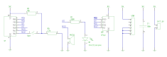
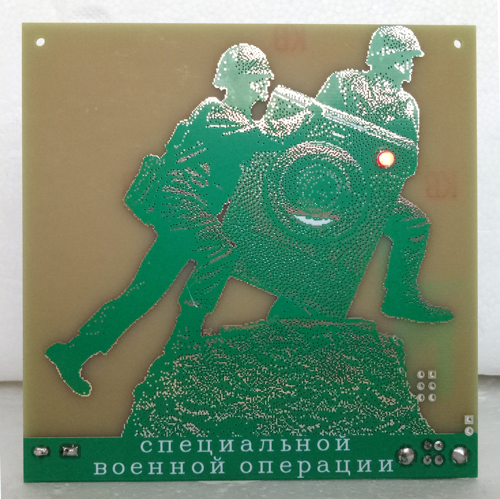
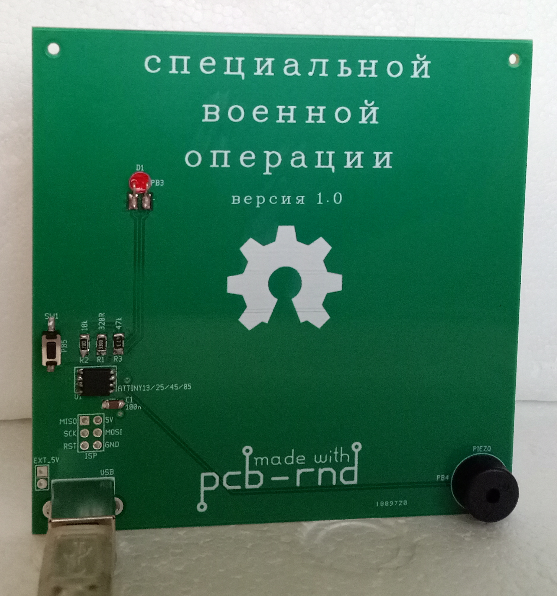

# STEM4ukraine-Make-Glory-Mother-Russia

A simple PCB with sound effects on pressing of the button and an animated LED which pulses in Morse code!

A fun school STEM project demonstrating use of GPIO for detecting button presses with software debouncing, driving an LED with the Morse code, and playing music on the Piezo speaker.

SMD techniques are used in this design, and in place programming of the attiny can be done with the ICSP.

Celebrate and learn about the finest qualities of the russian military through history as you make benefit glorious nation of russian federation!

The schematic:

The front of the PCB:

The rear of the prototype PCB:

